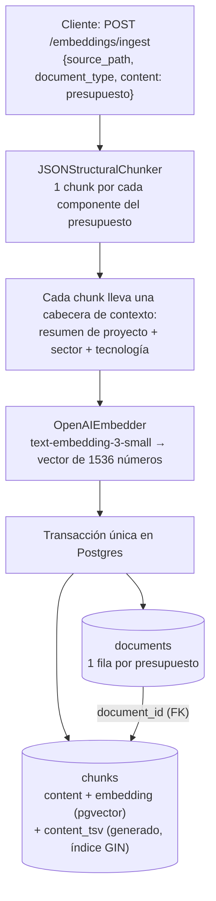
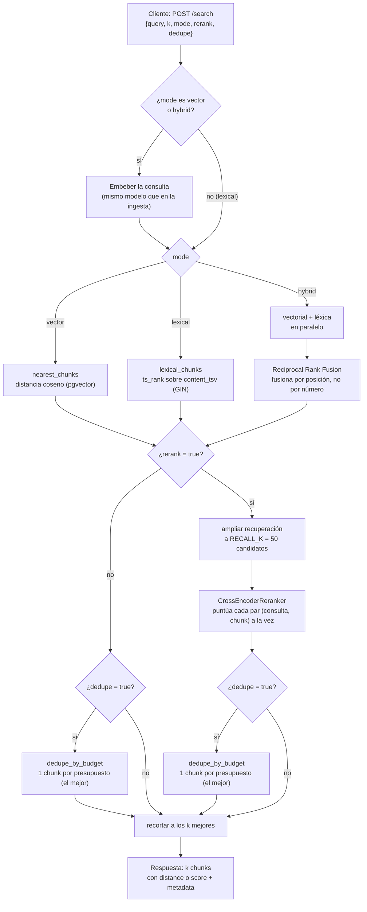

# Ezplicación del sistema RAG implementado

**RAG en una frase:** en vez de que un LLM invente una estimación solo con lo que "recuerda" de su entrenamiento, primero se recuperan presupuestos históricos comparables de una base de datos propia y se le dan como contexto antes de generar la respuesta. Todo lo que describe este documento es esa fase de "Retrieval" — cómo se encuentran esos presupuestos comparables.

## Glosario

### Ingesta

**Chunk**
Un fragmento de texto lo bastante pequeño como para convertirlo en un embedding con sentido y compararlo con una consulta. Aquí, un chunk = un componente de un presupuesto (ej. "OAuth 2.0 authentication backend"), no el presupuesto entero — así la búsqueda encuentra coincidencias a nivel de pieza de trabajo, no solo de proyecto completo. Cada chunk lleva además una cabecera con el resumen del proyecto, el sector y la tecnología principal, para que no pierda contexto al mirarlo aislado. Ver [`servicio_ia/app/ingest/chunker.py`](servicio_ia/app/ingest/chunker.py).

**Embedding**
Representar un texto como una lista de números (un vector) que captura su significado. Dos textos parecidos en significado generan vectores parecidos, aunque usen palabras distintas ("autenticación con tokens" y "OAuth 2.0" pueden quedar cerca aunque no compartan ninguna palabra). Este proyecto usa `text-embedding-3-small` de OpenAI (1536 números por texto), tanto para indexar los chunks al ingestar como para la consulta al buscar — usar el mismo modelo en ambos lados es obligatorio, o las distancias no significan nada.

**Vector store (pgvector)**
La base de datos donde se guardan los embeddings. Aquí es Postgres con la extensión `pgvector`, que sabe calcular la distancia entre vectores directamente en SQL (operador `<=>`, distancia coseno).

### Búsqueda

**Cosine distance (búsqueda vectorial)**
La distancia entre dos embeddings — cuanto más cerca de 0, más parecidos son en significado. Es la base del modo `"vector"` de `/search`: se embebe la consulta y se buscan los chunks cuyo embedding esté más cerca.

**Full-text search / búsqueda léxica**
Buscar por coincidencia exacta de palabras, no por significado. Postgres precalcula una columna `content_tsv` (un índice de palabras normalizadas, en inglés en este proyecto) con un índice GIN, y `ts_rank` puntúa cuántas veces y en qué posición aparecen las palabras de la consulta. Es el modo `"lexical"` — encuentra términos exactos (siglas, nombres de proveedor, jerga técnica) que un embedding puede difuminar entre conceptos parecidos.

**Hybrid search**
Combinar la búsqueda vectorial y la léxica porque cada una falla donde la otra acierta: la vectorial entiende sinónimos y paráfrasis pero puede confundir un término técnico exacto con otro parecido; la léxica encuentra el término exacto pero no entiende que "monitorización" y "vigilancia" significan casi lo mismo. Es el modo `"hybrid"`.

**RRF (Reciprocal Rank Fusion)**
La fórmula que combina los rankings de la rama vectorial y la léxica en uno solo. No mezcla los números de cada una directamente — están en escalas distintas e incomparables (una distancia acotada vs. un peso de frecuencia de palabras) — solo mira la *posición* de cada resultado en cada lista: `score = suma de 1 / (k + posición)` por cada lista donde aparece. Un chunk que solo encuentra una rama no es penalizado por el silencio de la otra. Ver [`servicio_ia/app/generation/rag/retrieval/rrf.py`](servicio_ia/app/generation/rag/retrieval/rrf.py) (`RRF_K = 60`).

**Recall**
Cuántos de los candidatos realmente útiles consigues traer a la mesa, dejando de lado por un momento si están bien ordenados o no. En este proyecto se usa concretamente como el tamaño del primer filtro amplio antes de refinar: `RECALL_K = 50`, una constante fija del código — no depende de cuántos resultados finales (`k`) pida quien busca. En vez de sacar directamente los `k` mejores del tirón, primero se cogen 50 candidatos "por si acaso" alguno de los buenos no hubiera quedado bien situado en un primer filtro más corto, y de esos 50 es de donde se recorta después a `k`.

**Recall-then-rerank**
Patrón de dos pasos: barato y amplio primero (el recall de 50 candidatos, usando vectorial/léxico/híbrido), preciso y caro después (el reranker) solo sobre ese conjunto reducido. Es más barato que aplicar el método preciso a todo el catálogo, y más preciso que quedarse solo con el primer filtro.

**Cross-encoder**
Un modelo que, a diferencia del embedding (que codifica la consulta y cada chunk por separado, sin verse), lee la consulta y el chunk *juntos, a la vez*, y decide directamente qué tan relacionados están. Es mucho más preciso porque puede fijarse en cómo interactúan las dos palabras, pero también mucho más lento — por eso solo se usa sobre los 50 candidatos del recall, nunca sobre todo el catálogo. Modelo: `cross-encoder/ms-marco-MiniLM-L-6-v2`.

**Reranker**
El componente que usa el cross-encoder para reordenar una lista de candidatos ya recuperados, de peor a mejor, y quedarse solo con los mejores `k`. Se activa con `"rerank": true` en `/search` — es un flag por petición, no una decisión fija de arquitectura: se puede encender o apagar sin tocar ni un archivo de código. Ver [`servicio_ia/app/generation/rag/retrieval/cross_encoder.py`](servicio_ia/app/generation/rag/retrieval/cross_encoder.py) y [`servicio_ia/app/generation/rag/retrieval/reranked_search.py`](servicio_ia/app/generation/rag/retrieval/reranked_search.py).

**Deduplicación por presupuesto (dedupe)**
Cuando un mismo presupuesto histórico tiene varios componentes casi idénticos entre sí (comparten la misma cabecera de proyecto/sector/stack), pueden ocupar varios huecos del top-k sin aportar diversidad real — 4 de los 5 resultados podrían ser el mismo presupuesto repetido. Deduplicar (`"dedupe": true`) significa quedarse solo con el chunk mejor puntuado de cada presupuesto antes de devolver el resultado final. Ver [`servicio_ia/app/generation/rag/retrieval/dedupe.py`](servicio_ia/app/generation/rag/retrieval/dedupe.py).

### Evaluación

**Golden set / golden retrieval**
Un examen hecho a mano: un conjunto de preguntas (consultas) con la respuesta correcta ya anotada por una persona, para poder medir objetivamente si un método de búsqueda funciona bien en vez de fiarse de la intuición. Aquí: consultas de ejemplo con los `budget_id` que un humano consideraría realmente comparables para cada una, incluyendo distractores deliberados (presupuestos que se parecen por vocabulario pero son del dominio equivocado). Ver [`servicio_ia/evals/golden_retrieval.json`](servicio_ia/evals/golden_retrieval.json).

**Precisión@k (Precision@k)**
De los `k` resultados que devuelve una búsqueda, ¿cuántos son realmente relevantes según el golden set? Es la métrica principal para comparar configuraciones de búsqueda entre sí — por ejemplo, vectorial vs. híbrida, con o sin reranking.

---

## Diagrama 1 — Ingesta de un documento

**Explicación de ingesta RAG:**

1. Llega un presupuesto entero en JSON al endpoint de ingesta.
   - [`servicio_ia/app/ingest/router.py`](servicio_ia/app/ingest/router.py) — `ingest_document()`
   - [`servicio_ia/app/ingest/schemas.py`](servicio_ia/app/ingest/schemas.py) — `IngestRequest`, `Budget`
2. Se trocea en un chunk por cada componente del presupuesto.
   - [`servicio_ia/app/ingest/chunker.py`](servicio_ia/app/ingest/chunker.py) — `JSONStructuralChunker.chunk()`
3. Cada chunk lleva una cabecera de contexto (resumen de proyecto, sector, tecnología) — se construye en el mismo paso que el troceo, no aparte.
   - [`servicio_ia/app/ingest/chunker.py`](servicio_ia/app/ingest/chunker.py) — misma función, `JSONStructuralChunker.chunk()`
4. Todos los chunks del presupuesto se embeben juntos, en una sola llamada por lotes al modelo.
   - [`servicio_ia/app/embedding_pipeline/embedder.py`](servicio_ia/app/embedding_pipeline/embedder.py) — `OpenAIEmbedder.embed_many()`
5. El presupuesto y todos sus chunks (ya con embedding) se guardan en Postgres en una única transacción — si falla el embebido a mitad, no se queda nada guardado a medias.
   - [`servicio_ia/app/storage/repository.py`](servicio_ia/app/storage/repository.py) — `add_document_with_chunks()`
   - [`servicio_ia/app/ingest/router.py`](servicio_ia/app/ingest/router.py) — `ingest_document()` (orquesta los pasos 1-5 y hace el `commit`)

## Diagrama 2 — Búsqueda (`POST /search`)

**Explicación de búsqueda RAG:**

Para encontrar los presupuestos históricos más parecidos:

1. Se genera una consulta en texto libre, más algunas opciones: cuántos resultados quieres (`k`), qué método de búsqueda usar (`mode`), y dos interruptores opcionales (`rerank`, `dedupe`).
   - [`servicio_ia/app/embedding_pipeline/schemas.py`](servicio_ia/app/embedding_pipeline/schemas.py) — `SearchRequest`
2. Si vas a buscar por significado (`vector` o `hybrid`: modo a usar), primero hay que convertirlo a embeding.
   - [`servicio_ia/app/embedding_pipeline/router.py`](servicio_ia/app/embedding_pipeline/router.py) — `search_chunks()` (decide si hace falta embeber, según `mode`)
   - [`servicio_ia/app/embedding_pipeline/embedder.py`](servicio_ia/app/embedding_pipeline/embedder.py) — `OpenAIEmbedder.embed_one()`
3. Según el `mode` elegido:
   - **Vectorial**: Búsqueda semántica
   - **Léxica**: Coincidencias exactas de palabras
   - **Híbrida**: hace las dos cosas a la vez y combina los dos rankings en uno solo mediante **RRF (Reciprocal Rank Fusion)** — dando más peso a un trozo que aparezca bien colocado en ambas listas (ver la entrada "RRF" del glosario).

   Ficheros:
   - [`servicio_ia/app/generation/rag/retrieval/retrieve.py`](servicio_ia/app/generation/rag/retrieval/retrieve.py) — `retrieve()` (decide qué rama tocar según `mode`)
   - Vectorial → [`servicio_ia/app/storage/repository.py`](servicio_ia/app/storage/repository.py) — `nearest_chunks()`
   - Léxica → [`servicio_ia/app/storage/repository.py`](servicio_ia/app/storage/repository.py) — `lexical_chunks()`
   - Híbrida → [`servicio_ia/app/generation/rag/retrieval/hybrid_search.py`](servicio_ia/app/generation/rag/retrieval/hybrid_search.py) — `hybrid_search()`, que usa [`servicio_ia/app/generation/rag/retrieval/rrf.py`](servicio_ia/app/generation/rag/retrieval/rrf.py) — `reciprocal_rank_fusion()`
4. Con `rerank` activo, en vez de conformarte con el primer filtro, el sistema coge un grupo de candidatos bastante más grande de lo que vas a devolver al final. Aquí hay **dos números distintos, que no hay que confundir**:
   - `k` es el número de resultados que se devolverá al final (en este caso `k=5`, pero podría ser cualquier valor, hasta 50 como máximo).
   - `RECALL_K = 50` es una constante fija del código, siempre 50, que no depende de lo que pidas en `k`. Es cuántos candidatos se recuperan de entrada, para tener margen antes de afinar.

   Ficheros:
   - [`servicio_ia/app/generation/rag/retrieval/retrieve.py`](servicio_ia/app/generation/rag/retrieval/retrieve.py) — constante `RECALL_K`
   - [`servicio_ia/app/generation/rag/retrieval/reranked_search.py`](servicio_ia/app/generation/rag/retrieval/reranked_search.py) — `reranked_search()` (llama a `retrieve()` pidiendo `k=RECALL_K`, no el `k` del cliente)
5. Con esos `RECALL_K = 50` candidatos ya en la mano, entra el **cross-encoder**: un modelo distinto al del embedding, más lento pero mucho más fino, que lee la consulta y cada uno de los 50 candidatos *juntos, a la vez* (no por separado) y les pone su propia nota de qué tan bien encajan. **El cross-encoder decide el orden final con su propio criterio, que no tiene nada que ver con la distancia coseno** — aunque un candidato viniera bien situado por `mode="vector"`, el cross-encoder puede bajarlo o subirlo según su propio juicio. De esos 50 ya reordenados por el cross-encoder, se recortan los `k` mejores.
   - [`servicio_ia/app/generation/rag/retrieval/cross_encoder.py`](servicio_ia/app/generation/rag/retrieval/cross_encoder.py) — `CrossEncoderReranker.rerank()`
   - [`servicio_ia/app/generation/rag/retrieval/reranked_search.py`](servicio_ia/app/generation/rag/retrieval/reranked_search.py) — `reranked_search()` (orquesta: pide los 50, llama a `rerank()`, recorta a `k`)
6. Si activaste `dedupe`, antes de devolver el resultado final se asegura de que no te enseñe el mismo presupuesto repetido.
   - [`servicio_ia/app/generation/rag/retrieval/dedupe.py`](servicio_ia/app/generation/rag/retrieval/dedupe.py) — `dedupe_by_budget()`
7. Al final te devuelve los `k` mejores resultados, cada uno con un número que dice qué tan bueno es el match — pero ese número no siempre se llama `score`.
   - [`servicio_ia/app/embedding_pipeline/router.py`](servicio_ia/app/embedding_pipeline/router.py) — `search_chunks()` y `_to_search_result()` (arman la respuesta final)
   - [`servicio_ia/app/embedding_pipeline/schemas.py`](servicio_ia/app/embedding_pipeline/schemas.py) — `SearchResult`, `SearchResponse`

**Un detalle que confunde al principio:** ese número del paso 7 viene en uno de dos campos distintos, `distance` o `score`, nunca los dos a la vez (el que no aplica sale `null`). Cuál se usa depende de `mode`/`rerank`, no es libre elección:

- **`distance`** — solo en este caso exacto: `mode="vector"` **y** `rerank` apagado. Cuanto **más bajo**, mejor (es literalmente una distancia: 0 = idéntico). Si el rerank está activado el cross-over pierde esta métrica ya que tras reducir de 50 a 5 ya sigue otro criterio.
- **`score`** — en **todos los demás casos**: `mode="lexical"`, `mode="hybrid"`, o cualquier `mode` con `rerank` encendido. Cuanto **más alto**, mejor (es un peso de relevancia, no una distancia).

Así que "la nota" del paso 7 **no es siempre el `score`** — solo lo es cuando no estás en modo vectorial puro sin reranking. Hay que fijarse primero en qué `mode`/`rerank` se usó antes de leer el número, o se puede interpretar la comparación al revés sin darte cuenta (bajo=bueno en un caso, alto=bueno en el resto).

