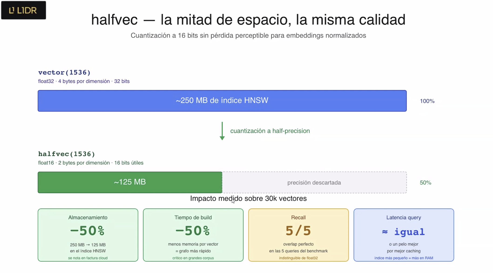
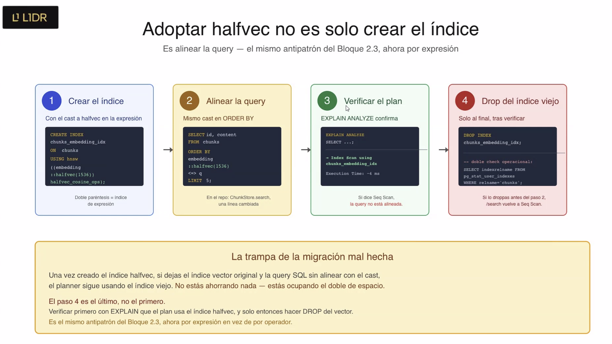
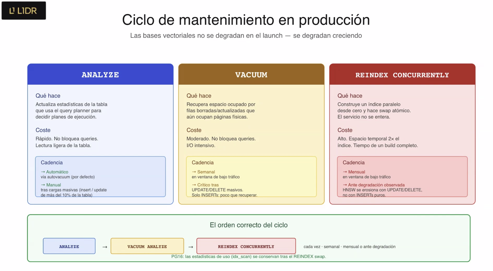

# Estimator CAG - Servicio de Estimacion de Software con IA

Servicio de estimacion de proyectos de software impulsado por IA, utilizando una arquitectura **Cache Augmented Generation (CAG)**.

## Que es CAG y por que lo usamos

CAG (Cache Augmented Generation) es un patron de arquitectura donde el contexto relevante se inyecta directamente en el prompt del LLM como texto estatico. En esta fase del proyecto, las estimaciones de referencia se incluyen como ejemplos dentro del prompt del sistema, sin necesidad de una base de datos vectorial ni busqueda semantica.

Este enfoque es ideal para empezar porque:
- Es simple de implementar y depurar
- No requiere infraestructura adicional (ni embeddings, ni vector stores)
- Funciona bien cuando el volumen de contexto es manejable (pocos ejemplos)

En modulos posteriores del master, este servicio evolucionara a una arquitectura **RAG** (Retrieval Augmented Generation) con base de datos vectorial para manejar un volumen mayor de ejemplos.

## Requisitos previos

- **Docker** y **Docker Compose** instalados
- Una **API key** de OpenAI o Anthropic
- Python **NO** es necesario localmente — todo se ejecuta dentro del contenedor

## Inicio rapido con Docker (recomendado)

1. Clonar el repositorio y entrar al directorio:
   ```bash
   cd estimator
   ```

2. Copiar el archivo de variables de entorno y configurar las API keys:
   ```bash
   cp .env.example .env
   # Editar .env y poner tu API key real
   ```

3. Construir y levantar el servicio:
   ```bash
   docker compose up --build
   ```

4. El servicio estara disponible en `http://localhost:8000`

## Alternativa: ejecucion local sin Docker

```bash
uv sync
# Configurar .env con tus API keys
uv run uvicorn app.main:app --reload
```

## Probar el servicio

```bash
curl -X POST http://localhost:8000/api/v1/estimate \
  -H "Content-Type: application/json" \
  -d '{
    "transcription": "The client wants to build a mobile app for managing restaurant reservations. They need user registration, a restaurant search with filters by cuisine and location, a real-time reservation system with availability checking, push notifications for reservation confirmations and reminders, and an admin panel for restaurant owners to manage their listings and view analytics."
  }'
```

## Forzar python 3.12

```
uv sync --all-packages --python 3.12
```

## Documentacion interactiva

Con el servicio corriendo, accede a la documentacion Swagger UI en:

- **Swagger UI:** [http://localhost:8000/docs](http://localhost:8000/docs)
- **ReDoc:** [http://localhost:8000/redoc](http://localhost:8000/redoc)

## Sesion 3 — LiteLLM, Redis cache, SSE y Streamlit

A partir de la Sesion 3 el servicio incorpora una capa de wrapper sobre el LLM que anade:

- **Fallback de proveedor** (LiteLLM Router) — si el modelo primario falla, se intenta el secundario
- **Cache exact-match** en Redis — la misma transcripcion no vuelve a pagar tokens
- **Streaming SSE** — endpoint `POST /api/v1/estimate/stream` que emite los tokens segun llegan
- **UI Streamlit** — cliente real que consume el endpoint SSE

### Arrancar la stack completa

```bash
cd estimator
docker compose up --build
# La API queda en http://localhost:8000 y Redis en redis://localhost:6379
```

### Probar el endpoint SSE

Demo HTML: abrir [http://localhost:8000/static/sse_demo.html](http://localhost:8000/static/sse_demo.html).

Desde CLI:
```bash
curl -N -X POST http://localhost:8000/api/v1/estimate/stream \
  -H 'Content-Type: application/json' \
  -d '{"transcription": "We need a small CRM with auth, contacts and roles. MVP six weeks."}'
```

### Verificar la cache

```bash
# La misma peticion dos veces — la segunda devuelve cache_hit: true
curl -s localhost:8000/api/v1/estimate -H 'Content-Type: application/json' \
  -d '{"transcription": "We need a small CRM with auth, contacts and roles. MVP six weeks."}' \
  | jq '{cache_hit, cost_usd}'

# Inspeccionar las claves en Redis
docker compose exec redis redis-cli KEYS 'estimation:*'
```

### Streamlit

Streamlit corre **fuera** de Docker y consume el endpoint SSE por HTTP:

```bash
cd estimator
uv sync
uv run streamlit run streamlit_app.py
# Abrir http://localhost:8501
```

La URL del backend se lee de `ESTIMATOR_API_BASE_URL` (default `http://localhost:8000`).

## Sesion 4 — Schemas tipados, prompts versionados y formulario

A partir de la Sesion 4 el endpoint `POST /api/v1/estimate` cambia de contrato y los prompts viven en plantillas Jinja2 versionadas:

- **Request**: `description` (20-2000 chars), `project_type`, `detail_level`, `output_format` (todos `Enum`).
- **Response**: `text` (markdown libre) + `prompt_version`.
- **Prompts**: `app/prompts/estimation/v1/{system,user,examples}.j2`. El loader (`app/prompts/loader.py`) expone `render_estimation_prompt(request, version="v1") -> (system, user)`. Cambiar `version` no toca el resto del codigo.
- **Streamlit**: el chat se sustituye por un `st.form` con textarea + tres `selectbox`. Envia el JSON al endpoint, renderiza la respuesta.

El endpoint de streaming (`POST /api/v1/estimate/stream`) sigue intacto para retrocompatibilidad.

### Levantar el proyecto

Hay un `Makefile` en la raiz que orquesta ambos servicios (FastAPI + Streamlit) sobre el mismo venv de uv (workspace):

```bash
make setup   # instala uv si falta y sincroniza root + ui (workspace)
make run     # backend en :8000 y UI en :8501 en paralelo; Ctrl-C los para
make stop    # libera los puertos si quedan procesos
make stress  # Ejecuta test stress
```

`make run` es idempotente: si los puertos ya estan ocupados, los libera antes de arrancar.

Antes de la primera ejecucion, configura al menos una API key en `.env` (no se commitea):

```
OPENAI_API_KEY=sk-...
# o
ANTHROPIC_API_KEY=sk-ant-...
```

### Ejecutar tests

```bash
uv run pytest                    # toda la suite
uv run pytest tests/prompts/     # solo tests de plantillas (milisegundos, sin red)
uv run pytest -k stream          # solo el endpoint SSE
```

Los tests de plantilla (`tests/prompts/test_estimation_v1.py`) validan que:

- la `description` aparece literal dentro de `<project_description>` en el user prompt,
- `confidence_pct` esta en el system **solo** cuando `output_format=phases_table`,
- el bloque `Assumptions` por fase aparece **solo** cuando `detail_level=detailed`,
- la instruccion `"Do not use tables"` aparece **solo** cuando `output_format=narrative`.

## Sesion 5 — Sesiones conversacionales y adjuntos locales

A partir de la Sesion 5 el servicio expone una capa de sesion para mantener historico de conversacion y metadatos del proyecto entre llamadas, y permite enriquecer la estimacion con documentos adjuntos (PDF y similares).

### Endpoints nuevos

- `POST /api/v1/sessions` -> `{"session_id": "<uuid4>"}`. El cliente guarda el id y lo reutiliza en peticiones siguientes para compartir memoria entre paginas.
- `POST /api/v1/sessions/{session_id}/estimate` -> mismo `EstimationResponse` que `/api/v1/estimate`, pero acepta `multipart/form-data` con:
  - `transcript` (str, requerido): transcripcion o descripcion libre.
  - `attachments` (list[UploadFile], opcional): documentacion complementaria.
  - `project_type`, `detail_level`, `output_format` (opcionales, con defaults).

Ejemplo:

```bash
SESSION=$(curl -s -X POST http://localhost:8000/api/v1/sessions | jq -r .session_id)

curl -X POST http://localhost:8000/api/v1/sessions/$SESSION/estimate \
  -F 'transcript=El cliente quiere un portal interno para gestionar contratos...' \
  -F 'attachments=@spec.pdf' \
  -F 'project_type=internal_tool' \
  -F 'detail_level=detailed'
```

### Estrategia de adjuntos: extraccion local con pypdf y python-docx

Cuando llegan adjuntos, el servicio **no** los reenvia al proveedor LLM. Los parsea localmente con librerias ligeras por extension y concatena el texto extraido al `transcript` con un separador explicito antes de construir el prompt:

| Extension      | Libreria       | Notas                                    |
|----------------|----------------|------------------------------------------|
| `.pdf`         | `pypdf`        | Texto por pagina, paginas vacias se omiten. |
| `.docx`        | `python-docx`  | Texto por parrafo, parrafos vacios se omiten. |
| `.md` / `.txt` | stdlib         | Decodificado UTF-8 con fallback latin-1. |

Formato del prompt resultante:

```
<transcript original>

--- attachment: spec.pdf ---

<texto extraido pagina a pagina>

--- attachment: contratos.docx ---

<texto extraido parrafo a parrafo>
```

Tipos no soportados devuelven `422` con un mensaje claro; el cliente no debe asumir que cualquier binario se acepta.

#### Por que no usar una Files API del proveedor (OpenAI, Anthropic, ...)

- La extraccion corre dentro de nuestro proceso, asi que podemos cambiar de proveedor LLM (o pasar a un modelo self-hosted) sin tocar esta capa. Una Files API ata el ciclo de vida del adjunto, su retencion y su precio a un unico vendor; migrar implica reescribir esta capa.
- Las Files API cobran tokens por todo el documento en cada llamada que lo referencia. Nosotros extraemos una sola vez en el CPU que ya pagamos y el texto es cacheable como cualquier otro input.
- El texto que llega al prompt es **auditable** — se loguea su tamano, se puede diffear y cachear. Una Files API esconde el parsing detras de una llamada al modelo que no podemos inspeccionar.

#### Por que pypdf + python-docx y no una herramienta mas potente

- Son **puro Python** (o casi), MIT-licensed, sin dependencias nativas ni modelos de ML. Instalan en todas las plataformas que nos importan (incluido macOS Intel) en segundos y no hinchan la imagen Docker.
- **Prepara el terreno para el modulo 3 (RAG).** Una vez el texto extraido es ciudadano de primera clase en esta capa, el siguiente paso — chunking + embeddings para retrieval — es una preocupacion local que no cambia el contrato del upload ni el router. Mover esta capa a una pipeline con vector store es aditivo, no destructivo.
- Asumimos el trade-off: la fidelidad de extraccion en PDFs complejos (escaneados, multi-columna, formularios) es menor que la de toolkits con OCR. Si en su dia esa fidelidad pasa a ser un requisito real, sustituir `_extract_pdf` por PyMuPDF o pdfplumber es un cambio de una funcion, no de la arquitectura.

### Project Metadata Injection

Cada sesion mantiene un blob `ProjectMetadata` (nombre, tamano de equipo asumido, tecnologias mencionadas y `agreed_scope`) que se inyecta en el system prompt dentro de un bloque dedicado:

```
<project_metadata>
- project_name: HR Onboarding Portal
- assumed_team_size: 5
- mentioned_technologies: Java, Spring Boot, PostgreSQL
- agreed_scope: MVP con auth, flujo de onboarding y panel de aprobaciones.
</project_metadata>
```

El bloque se renderiza **siempre** (presente en `system.j2` v1 y v2); en la primera llamada de la sesion el cuerpo esta vacio. Cuando hay hechos conocidos, el LLM los trata como ground truth: no debe contradecirlos ni volver a preguntarlos.

#### Por que actualizamos `ProjectMetadata` con una segunda llamada al LLM y no con regex / NER

Tras cada estimacion lanzamos una **segunda llamada** al LLM (`app/services/metadata_extractor.py`) que recibe el metadata actual, el nuevo turno de usuario y la respuesta del asistente, y devuelve un JSON validado contra `ProjectMetadata` (via Instructor). El nuevo blob reemplaza al anterior en `session.metadata`.

Decidimos usar un LLM en vez de patrones regulares o NER porque la extraccion necesita **comprension**, no solo coincidencia:

- **Inferencia transitiva de tecnologias.** Un usuario que dice "tenemos un servicio en Spring Boot" esta hablando implicitamente de **Java** (y de la JVM). Una regex sobre la cadena `"Spring Boot"` no captura `Java` porque la palabra nunca aparece. El LLM si lo deduce, y el prompt se enriquece con la tecnologia subyacente. Lo mismo aplica a Next.js -> React/JavaScript, FastAPI -> Python, Kotlin -> JVM, .NET MAUI -> C#, etc.
- **Normalizacion y dedup.** "Postgres", "PostgreSQL" y "postgres 16" son la misma tecnologia; "five people", "un equipo de cinco" y "5 personas" son el mismo `assumed_team_size`. Mantener una tabla de sinonimos a mano y combinarla con regex no escala y se rompe en cuanto cambia la forma de hablar del cliente.
- **Refinamientos sobrescribibles.** El cliente puede decir "en realidad somos seis personas, no tres" varios turnos despues. El LLM razona sobre el contexto y reemplaza el valor antiguo; una regex no sabe que el segundo numero invalida al primero.
- **`agreed_scope` es resumen, no extraccion literal.** Hay que condensar 1-3 frases que reflejen el consenso conversacional, no buscar una subcadena. Esto solo lo hace bien un modelo.
- **Robusto a transcripciones ruidosas.** Los `transcript` reales incluyen muletillas, frases incompletas y texto extraido de PDFs/DOCX con saltos raros. La regex se rompe; el LLM lo tolera.

El coste asumido es claro: una segunda llamada por turno (modelo pequeno, prompt corto, respuesta estructurada) y la posibilidad de que la extraccion falle. Mitigamos lo segundo capturando cualquier excepcion del extractor y conservando el metadata previo, asi un fallo del extractor nunca tira la estimacion principal.

## Sesion 7 — Embedding pipeline (servicio_ia)

Primer paso hacia RAG: un servicio FastAPI independiente (`servicio_ia/`) que trocea presupuestos historicos normalizados (`data/budgets_sample.json`, 15 presupuestos / 63 componentes) y los vectoriza con `text-embedding-3-small` (dimension por defecto, 1536).

- **Chunking estructural** (`JSONStructuralChunker`): un componente del presupuesto = un chunk, con el contexto del presupuesto padre prependido como *contextual chunk header*. Sin overlap ni splitting.
- **Embedder** (`OpenAIEmbedder`): llamadas en batches de 100, reintento exponencial ante rate limits (1s/2s/4s), logging estructurado por batch y coste estimado ($0.02 por millon de tokens de entrada).
- **Sin numpy ni scikit-learn**: la similitud coseno se calcula a mano con la biblioteca estandar (`scripts/compare.py`).

### Levantar el servicio IA

Con Docker (requiere rebuild la primera vez para instalar `tiktoken`):

```bash
docker compose up --build ai_service
```

En local sin Docker (desde la raiz del repo):

```bash
uv sync
uv run --env-file .env uvicorn app.main:app --port 8001 --app-dir servicio_ia
```

Swagger UI: `http://localhost:8001/docs`.

### Invocar el endpoint de ingesta

`POST /embeddings/ingest` recibe `{"budgets": [...]}` y devuelve los chunks vectorizados mas las estadisticas del run (`total_budgets`, `total_chunks`, `total_tokens`, `estimated_cost_usd`):

```bash
python3 -c "import json; json.dump({'budgets': json.load(open('servicio_ia/data/budgets_sample.json'))}, open('/tmp/ingest.json','w'))"

curl -X POST http://localhost:8001/embeddings/ingest \
  -H "Content-Type: application/json" \
  -d @/tmp/ingest.json | python3 -m json.tool | head -30
```

Un payload que viole los invariantes del dataset (totales que no cuadran, dependencias fantasma, sector desconocido) devuelve **422** sin llegar a tocar la API de embeddings. Un error no controlado del proveedor devuelve **500** con mensaje generico (el detalle queda en los logs).

### Correr compare.py (sanity check de embeddings)

Fuera del contenedor, desde la raiz del repo:

```bash
uv run --env-file .env python servicio_ia/scripts/compare.py
```

Dentro del contenedor (el servicio debe estar levantado):

```bash
docker compose exec servicio_ia python scripts/compare.py
```

El script embebe tres parejas de chunks y verifica que el orden de similitud coseno respete la semantica esperada (near-duplicates > relacionados > sin relacion). Resultados y comentario en `servicio_ia/app/embedding_pipeline/SANITY_CHECK.md`.

## Sesion 8 — Vector store con pgvector y busqueda semantica

El servicio IA persiste ahora los embeddings en Postgres con la extension `pgvector` (imagen `pgvector/pgvector:pg16` en el compose, schema gestionado con Alembic). Esto cambia dos cosas respecto a la Sesion 7:

- `POST /embeddings/ingest` ya no devuelve los vectores: persiste documento + chunks en una transaccion unica y responde con identificadores y metricas. Nuevo endpoint `POST /search` de busqueda semantica por distancia coseno.
- `scripts/compare.py` se reemplaza por `query_examples.py` (`docker compose run --rm ai_service python query_examples.py`), que ejercita `POST /search` con cinco queries representativas; el output de un run contra el corpus de ejemplo esta en `servicio_ia/output_examples.txt`. El servicio compose pasa a llamarse `ai_service`.

Contratos, ejemplos y detalles operativos: [`servicio_ia/README.md`](servicio_ia/README.md).

### Vector schema decisions

**Por que dos tablas (`documents` y `chunks`) y no una.** Un presupuesto produce N chunks. Una sola tabla con la metadata del documento duplicada en cada fila pierde integridad referencial y duplica datos. Con dos tablas y `ON DELETE CASCADE`, eliminar un presupuesto elimina automaticamente todos sus chunks.

**Por que `metadata` como JSONB y no columnas.** La metadata estable (tipo de documento, tipo de chunk, fechas) va en columnas tipadas; la variable o que el chunker puede enriquecer (tags, scope, tecnologias mencionadas) va en JSONB. El indice GIN sobre el JSONB permite consultar por claves arbitrarias sin migrar el schema cada vez que el chunker aprende a extraer un campo nuevo.

**Por que `cosine_distance` y no L2 ni inner product.** Los embeddings de OpenAI vienen normalizados (norma 1), y sobre vectores unitarios las tres metricas producen el mismo ranking: la L2 es monotona con la coseno y el inner product es su complemento. La eleccion no va de calidad de resultados, va de consistencia: coseno es la convencion dominante en la literatura RAG, y el indice HNSW que se anadira en el directo usara la operator class `vector_cosine_ops`. Esa alineacion importa: si la query usa un operador y el indice esta construido con otra operator class, Postgres ignora el indice y cae a sequential scan **sin avisar**.

**Por que deliberadamente no hay indice vectorial todavia.** Sin indice, Postgres hace sequential scan: busqueda exacta con recall perfecto. Para el volumen del corpus del programa (decenas de documentos, cientos de chunks) eso responde en pocos ms — la latencia del endpoint la domina el embedding de la query, no la busqueda. Un indice ANN como HNSW introduce parametros de construccion y un trade-off de recall que a esta escala no compran nada. Ademas, observar la latencia sin indice es la linea base del directo: el indice se anade en vivo, cuando su efecto se puede medir.

---

> Este proyecto forma parte del **Master en AI Engineering** y servira como base para evolucionar hacia una arquitectura RAG con base de datos vectorial en modulos posteriores.


# INDEX VECTORS

## IVFFlat: Clusters de información

No, pero es especialmente adecuado cuando:

tienes un conjunto de datos bastante estable,
haces muchas más búsquedas que inserciones,
puedes permitirte reconstruir el índice periódicamente.

Por ejemplo:

Un catálogo de productos que cambia poco.
Una base documental que se actualiza una vez al día.
Un histórico de artículos.
¿Y HNSW?

## HNSW: Multiples capas de información

recibes documentos continuamente,
tienes un sistema RAG donde se indexan archivos nuevos todo el día,
los embeddings cambian con frecuencia.

Por eso la mayoría de bases de datos vectoriales modernas lo usan como opción por defecto.

# OPERATOR CLASS

Cómo debe funcionar un índice para un determinado tipo de dato.

```sql
CREATE INDEX idx_embedding
ON documentos
USING hnsw (
    embedding vector_cosine_ops
);
```

* vector_cosine_ops: Mide el ángulo entre dos vectores para RAG, búsqueda semántica y recuperación de información. Es útil cuando se desea encontrar elementos similares en un espacio vectorial, como en sistemas de recomendación, búsqueda de imágenes o procesamiento de lenguaje natural.
* vector_ip_ops: Mide el producto escalar, Ranking o sistemas de recomendación, búsqueda de imágenes 
* vector_l2_ops: Mide la distancia euclidiana, Clustering, clasificación y análisis de datos
* vector_l1_ops: Mide la distancia Manhattan, Análisis de datos, detección de anomalías y sistemas de recomendación

USA EL MISMO OPERATOR PARA GENERAR EL EMBEDING Y PARA EL INDICE
(Usa una operator class que corresponda con la métrica de similitud para la que fue diseñado el modelo de embeddings.)


# Ajustando la calidad de búsqueda en HNSW

Recall es una métrica que mide cuántos de los resultados correctos has conseguido recuperar. Ejemplo:
  De los 5 documentos correctos, ha recuperado 3/5 = 60% de recall
Muchas empresas crean un conjunto de preguntas conocidas para calcular el valor de recall.

ef_search es uno de los parámetros más importantes de HNSW. Controla el esfuerzo que hace el algoritmo durante una búsqueda.
* Cuanto mayor sea ef_search, más nodos del grafo explora HNSW antes de devolver el resultado.
* Un valor más alto de ef_search generalmente conduce a una mayor precisión en la búsqueda, ya que el algoritmo tiene más oportunidades de encontrar los vecinos más cercanos.
* Sin embargo, un ef_search más alto también puede aumentar el tiempo de búsqueda, la latencia y el uso de memoria

La idea es hacer un script cada cierto tiempo ajustando el ef_search midiendo el recall y eficiencia






# Retrieval 

* top K (número de chunks)
* distancia (cuanto de cerca lo queremos): con algo crítico debe ser mayor y si es información general puede ser menor.
* filtros

