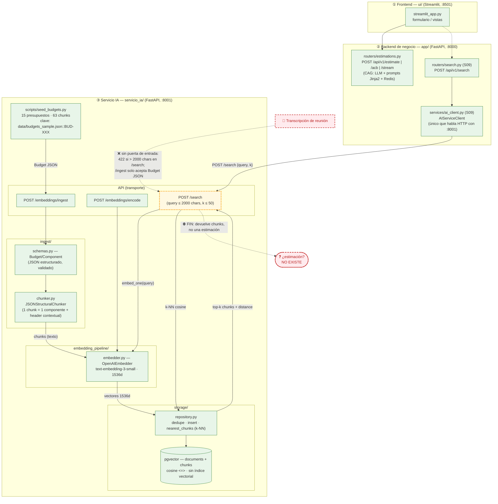
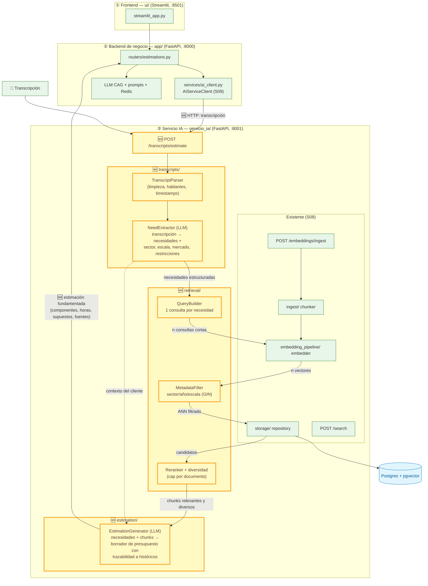

# Diagnóstico arquitectónico — Sesión 09 (pre-work)

Estado del sistema `estimator` al cierre de Sesión 08 (más el cableado backend ⇄ servicio IA
añadido en S09), comportamiento observado al pasarle una transcripción cruda, fallos concretos y
propuesta de evolución hasta cerrar el bucle transcripción → estimación.

> **Cómo está escrito este documento.** Las observaciones van en español; los comandos, payloads y
> nombres de campo van en inglés. El trace de la sección 2 es reproducible: los comandos están
> puestos tal cual se ejecutan desde la raíz del repo, y la salida pegada en los bloques de
> respuesta es la **salida real** del sistema (solo se abrevian campos de eco muy largos, y se
> indica cuándo).

> **Nota de fidelidad.** El enunciado describe el servicio IA con los nombres genéricos `ingest/`,
> `embedding_pipeline/` y `storage/`. Este repo los implementa **literalmente** con esos nombres
> bajo `servicio_ia/app/`, con los endpoints `POST /embeddings/ingest`, `POST /embeddings/encode` y
> `POST /search`. Además, desde S09 el backend de negocio habla con el servicio IA a través de un
> único cliente HTTP (`app/services/ai_client.py`, `AIServiceClient`) y expone el proxy
> `POST /api/v1/search`.

---

## 1. Diagrama de la arquitectura actual

Tres capas. El servicio IA está bajado un nivel. El **borde sombreado** (amarillo) marca dónde
acaba lo implementado hoy: el flujo muere en *"lista de chunks + distancias"*. **No existe ninguna
flecha que vaya desde una transcripción hasta una estimación.**



**Lectura del diagrama.** Lo implementado (verde) cubre tres caminos: (a) **ingesta** —
`/embeddings/ingest` valida un presupuesto estructurado, lo trocea en chunks por componente, los
embebe y los persiste en pgvector; (b) **búsqueda** — `/search` embebe el texto de consulta con el
mismo modelo y devuelve los *k* chunks más cercanos por distancia coseno; (c) **cableado S09** — el
backend de negocio llega a esa búsqueda a través de `AIServiceClient`, único punto de contacto HTTP
entre las capas ② y ③. El borde amarillo (`/search`) es el último eslabón vivo: **su salida es una
lista de chunks con distancias, no una estimación**. Las cajas rojas marcan los dos huecos: una
transcripción no tiene por dónde entrar (422 por longitud; `/ingest` exige `Budget` JSON), y la
conversión chunks → estimación no existe en ninguna forma. El pipeline CAG de `/api/v1/estimate`
sigue sin recibir ni un solo chunk del retrieval. Ese es exactamente el hueco que abre la Sesión 09.

---

## 2. Trace anotado de una transcripción

Transcripción usada: `examples/transcripts/02_ambiguous.txt` — reunión exploratoria con Rubén
Castaño (Casa Castaño, tienda gourmet física desde 1992). Pide, de forma difusa: tienda online,
fidelización por puntos, panel de control con gráficas y stock, pago con tarjeta con foco en
abandono de carrito, email de confirmación de pedido, mercado España (quizá Francia). 2.854
caracteres.

Preparación del entorno:

```bash
docker compose up -d --build postgres ai_service
make db_upgrade   # alembic upgrade head
make seed_ia      # idempotente: "Done: 0 ingested, 15 already present, 0 failed."
```

### Paso 1 — Embeber la transcripción completa (`POST /embeddings/encode`)

```bash
python3 - <<'EOF'
import json, math, pathlib, urllib.request

text = pathlib.Path("examples/transcripts/02_ambiguous.txt").read_text(encoding="utf-8")
payload = {"texts": [text]}
req = urllib.request.Request(
    "http://localhost:8001/embeddings/encode",
    data=json.dumps(payload).encode(),
    headers={"Content-Type": "application/json"},
)
resp = json.load(urllib.request.urlopen(req))
vec = resp["embeddings"][0]
print(json.dumps({
    "model": resp["model"],
    "embedding_dimension": resp["embedding_dimension"],
    "encode_time_ms": resp["encode_time_ms"],
    "first_component": vec[0],
    "last_component": vec[-1],
    "l2_norm": math.sqrt(sum(x * x for x in vec)),
}, indent=2))
EOF
```

Salida real (resumen del vector; las 1536 componentes no se pegan por tamaño):

```json
{
  "model": "text-embedding-3-small",
  "embedding_dimension": 1536,
  "encode_time_ms": 2849,
  "first_component": 0.00623321533203125,
  "last_component": 0.019012451171875,
  "l2_norm": 0.9996907476252158
}
```

> **Comentario**: el vector es un único punto de 1536 dimensiones, ya normalizado (‖v‖ ≈ 1.0,
> listo para similitud coseno), que representa el *promedio semántico* de toda la reunión: mezcla
> en una sola dirección la tienda online, los puntos de fidelidad, el panel, los pagos, los
> emails… y también el ruido conversacional (el café, el cuaderno, la sobrina, el primo de
> Francia). Ninguna necesidad concreta domina la representación.

### Paso 2 — Búsqueda semántica (`POST /search`, k=5)

`/search` acepta texto (embebe la consulta en servidor con el mismo modelo), no un vector. Primer
intento con la transcripción completa:

```bash
python3 - <<'EOF'
import json, pathlib
text = pathlib.Path("examples/transcripts/02_ambiguous.txt").read_text(encoding="utf-8")
pathlib.Path("/tmp/search_full.json").write_text(json.dumps({"query": text, "k": 5}))
pathlib.Path("/tmp/search_trunc.json").write_text(json.dumps({"query": text[:2000], "k": 5}))
EOF
curl -s -w "\nHTTP %{http_code}\n" -X POST http://localhost:8001/search \
  -H "Content-Type: application/json" -d @/tmp/search_full.json
```

Salida real (el campo `input`, eco de los 2.854 chars, se elide por brevedad):

```json
{"detail":[{"type":"string_too_long","loc":["body","query"],
  "msg":"String should have at most 2000 characters",
  "input":"Reunión exploratoria — sin título claro todavía\nCliente: Rubén Castaño…",
  "ctx":{"max_length":2000}}]}
HTTP 422
```

> **Comentario**: el sistema **rechaza la transcripción tal cual**. `SearchRequest.query` está
> limitado a 2000 caracteres (`servicio_ia/app/embedding_pipeline/schemas.py`) porque fue diseñado
> para consultas cortas, no para actas de reunión. Primer punto donde el flujo se rompe.

Segundo intento, truncando a los primeros 2000 caracteres:

```bash
curl -s -X POST http://localhost:8001/search \
  -H "Content-Type: application/json" -d @/tmp/search_trunc.json
```

Salida real (campo `query` abreviado):

```json
{
  "query": "Reunión exploratoria — sin título claro todavía\nCliente: Rubén Castaño (gerente,…",
  "k": 5,
  "search_time_ms": 1559,
  "results": [
    {
      "chunk_id": 59, "document_id": 14, "chunk_type": "budget_component",
      "content": "[Project: Fashion e-commerce replatform with ERP inventory synchronization and a customer loyalty program]\n[Client sector: ecommerce | Year: 2024 | Main tech: php_laravel]\n\nComponent: Checkout and payments\nDescription: One-page checkout with Redsys and Bizum integration, express checkout for returning customers, and abandoned cart recovery emails.\nTech stack: php_laravel, redsys, mysql\nComplexity: high\nEstimated hours: 120",
      "distance": 0.6092,
      "metadata": {"year": 2024, "chunk_id": "BUD-2024-009::CHK-001", "budget_id": "BUD-2024-009", "complexity": "high", "token_count": 90, "component_id": "CHK-001", "client_sector": "ecommerce", "estimated_hours": 120, "main_technology": "php_laravel"}
    },
    {
      "chunk_id": 40, "document_id": 10, "chunk_type": "budget_component",
      "content": "[Project: Multi-vendor marketplace platform with Elasticsearch-powered search and a personalized recommendation engine]\n[Client sector: ecommerce | Year: 2023 | Main tech: python_django]\n\nComponent: Cart and multi-vendor checkout\nDescription: Cart splitting per vendor, shipping cost calculation per parcel, order orchestration across vendors, and stock reservation with expiry.\nTech stack: python_django, postgresql, redis\nComplexity: high\nEstimated hours: 130",
      "distance": 0.6132,
      "metadata": {"year": 2023, "chunk_id": "BUD-2023-005::CHK-001", "budget_id": "BUD-2023-005", "complexity": "high", "token_count": 93, "component_id": "CHK-001", "client_sector": "ecommerce", "estimated_hours": 130, "main_technology": "python_django"}
    },
    {
      "chunk_id": 42, "document_id": 10, "chunk_type": "budget_component",
      "content": "[Project: Multi-vendor marketplace platform with Elasticsearch-powered search and a personalized recommendation engine]\n[Client sector: ecommerce | Year: 2023 | Main tech: python_django]\n\nComponent: Search and faceted navigation\nDescription: Elasticsearch-backed product search with typo tolerance, Swedish language analyzers, faceted filters, and near-real-time index sync from the catalog.\nTech stack: elasticsearch, python_django\nComplexity: medium\nEstimated hours: 80",
      "distance": 0.6232,
      "metadata": {"year": 2023, "chunk_id": "BUD-2023-005::SRC-001", "budget_id": "BUD-2023-005", "complexity": "medium", "token_count": 94, "component_id": "SRC-001", "client_sector": "ecommerce", "estimated_hours": 80, "main_technology": "python_django"}
    },
    {
      "chunk_id": 51, "document_id": 12, "chunk_type": "budget_component",
      "content": "[Project: B2B ordering platform for automotive spare parts with EDI integration and warehouse management]\n[Client sector: industrial | Year: 2023 | Main tech: java_spring]\n\nComponent: Sales analytics dashboard\nDescription: Dealer and product-line sales analytics with monthly trend charts, dead-stock detection, and scheduled Excel exports for area managers.\nTech stack: java_spring, metabase\nComplexity: medium\nEstimated hours: 70",
      "distance": 0.6297,
      "metadata": {"year": 2023, "chunk_id": "BUD-2023-007::ANL-001", "budget_id": "BUD-2023-007", "complexity": "medium", "token_count": 90, "component_id": "ANL-001", "client_sector": "industrial", "estimated_hours": 70, "main_technology": "java_spring"}
    },
    {
      "chunk_id": 39, "document_id": 10, "chunk_type": "budget_component",
      "content": "[Project: Multi-vendor marketplace platform with Elasticsearch-powered search and a personalized recommendation engine]\n[Client sector: ecommerce | Year: 2023 | Main tech: python_django]\n\nComponent: Product catalog service\nDescription: Multi-vendor catalog with variant management, bulk CSV import per vendor, image processing pipeline, and category taxonomy administration.\nTech stack: python_django, postgresql, celery\nComplexity: medium\nEstimated hours: 90",
      "distance": 0.6327,
      "metadata": {"year": 2023, "chunk_id": "BUD-2023-005::CAT-001", "budget_id": "BUD-2023-005", "complexity": "medium", "token_count": 90, "component_id": "CAT-001", "client_sector": "ecommerce", "estimated_hours": 90, "main_technology": "python_django"}
    }
  ]
}
```

> **Comentario**: hay señal — 4 de 5 chunks son de ecommerce y el checkout con recuperación de
> carrito abandonado encaja con lo que pide Rubén — pero las cinco distancias caben en una banda
> de **0.0235** (0.6092–0.6327): el ranking es casi plano y poco discriminante.

### Paso 3 — Análisis chunk a chunk

| # | Chunk | Presupuesto histórico | Sector | ¿Relevante para Rubén? |
|---|-------|----------------------|--------|------------------------|
| 1 | `BUD-2024-009::CHK-001` — Checkout and payments (0.6092) | Replatform ecommerce de moda con ERP y programa de fidelización | ecommerce | **Sí, el mejor del top-5**: pago con tarjeta (Redsys/Bizum) y emails de recuperación de carrito abandonado — Rubén menciona explícitamente el miedo a "que se me vayan en el último paso". |
| 2 | `BUD-2023-005::CHK-001` — Cart and multi-vendor checkout (0.6132) | Marketplace multi-vendor con Elasticsearch y recomendador | ecommerce | **A medias**: es checkout, pero de un marketplace multi-vendedor (cart splitting, orquestación entre vendors) — una escala y complejidad que no tienen nada que ver con una tienda gourmet familiar. Las horas (130h, high) contaminarían la estimación. |
| 3 | `BUD-2023-005::SRC-001` — Search and faceted navigation (0.6232) | El mismo marketplace | ecommerce | **No**: búsqueda con Elasticsearch, tolerancia a typos y analizadores en sueco. Rubén jamás pidió búsqueda avanzada. Entra por parecido genérico "producto/tienda online". |
| 4 | `BUD-2023-007::ANL-001` — Sales analytics dashboard (0.6297) | Plataforma B2B de recambios de automoción con EDI | **industrial** | **A medias, y preocupante**: el *concepto* (panel de ventas con gráficas y stock muerto) encaja con "el panel del café de la mañana", pero es de otro sector, B2B, Java/Metabase. Que un chunk industrial entre en el top-5 demuestra que nada filtra por sector. |
| 5 | `BUD-2023-005::CAT-001` — Product catalog service (0.6327) | El mismo marketplace, tercera vez | ecommerce | **No a esta escala**: catálogo multi-vendor con import CSV masivo y pipeline de imágenes. Rubén necesita un catálogo de conservas, vinos y aceite. 3 de 5 chunks vienen del mismo presupuesto (BUD-2023-005), cero diversidad. |

Siendo honesto: el retrieval **no es un desastre** — la señal ecommerce domina y el chunk #1 es
genuinamente útil — pero es **poco discriminante y nada fiel a lo pedido**: la fidelización, que
Rubén pide explícitamente ("algo de puntos, o un club"), ni aparece. Verificación con `k=15`:

```bash
python3 - <<'EOF'
import json, pathlib, urllib.request
text = pathlib.Path("examples/transcripts/02_ambiguous.txt").read_text(encoding="utf-8")
req = urllib.request.Request("http://localhost:8001/search",
    data=json.dumps({"query": text[:2000], "k": 15}).encode(),
    headers={"Content-Type": "application/json"})
for r in json.load(urllib.request.urlopen(req))["results"]:
    print(f'{r["distance"]:.4f}  {r["metadata"]["chunk_id"]}  sector={r["metadata"]["client_sector"]}')
EOF
```

```text
0.6092  BUD-2024-009::CHK-001  sector=ecommerce
0.6131  BUD-2023-005::CHK-001  sector=ecommerce
0.6232  BUD-2023-005::SRC-001  sector=ecommerce
0.6296  BUD-2023-007::ANL-001  sector=industrial
0.6327  BUD-2023-005::CAT-001  sector=ecommerce
0.6338  BUD-2022-003::STF-001  sector=ecommerce
0.6417  BUD-2024-009::STF-001  sector=ecommerce
0.6422  BUD-2023-007::ORD-001  sector=industrial
0.6424  BUD-2024-009::LOY-001  sector=ecommerce   ← la fidelización, en el puesto 9
0.6431  BUD-2023-005::REC-001  sector=ecommerce
0.6437  BUD-2023-005::PAY-001  sector=ecommerce
0.6513  BUD-2023-007::WMS-001  sector=industrial
0.6524  BUD-2024-009::ERP-001  sector=ecommerce
0.6551  BUD-2022-003::PAY-001  sector=ecommerce
0.6560  BUD-2022-003::SLT-001  sector=ecommerce
```

> **Comentario**: 15 resultados en una banda de **0.047**. El componente de fidelización
> (`LOY-001`) queda 9º, por detrás de un dashboard industrial y de la gestión de pedidos EDI de
> recambios de coche. La consulta-promedio no puede priorizar lo que el cliente pidió de forma
> explícita.

---

## 3. Diagnóstico: cinco fallos identificados

### Fallo 1 — La transcripción completa no cabe: `/search` devuelve 422

- **Problema observado**: enviar los 2.854 caracteres de `02_ambiguous.txt` a `POST /search` produce `HTTP 422 string_too_long, max_length: 2000` (paso 2 del trace). El sistema literalmente no admite el artefacto de entrada del caso de uso.
- **Causa probable**: `SearchRequest.query` se diseñó en S08 para consultas cortas tipo "pasarela de pago para ecommerce"; no existe ninguna ruta pensada para transcripciones (el otro endpoint de entrada, `/embeddings/ingest`, solo acepta `Budget` JSON estructurado y validado).
- **Propuesta de solución**: una etapa de procesamiento de transcripciones previa al retrieval (parseo + extracción de necesidades), en lugar de subir el `max_length` — que solo trasladaría el problema al fallo 3.

### Fallo 2 — Truncar amputa requisitos: el email transaccional desaparece de la consulta

- **Problema observado**: el workaround `text[:2000]` corta en mitad de la pregunta del minuto [00:03:40] y pierde 854 caracteres, incluyendo la petición del correo de confirmación de pedido y el alcance geográfico (España, quizá Francia). Coherentemente, ningún chunk de notificaciones/email aparece en los resultados.
- **Causa probable**: no hay extracción semántica de requisitos; la "consulta" es un prefijo arbitrario de bytes de la conversación, y lo que caiga después del corte deja de existir para el sistema.
- **Propuesta de solución**: un extractor (LLM) que convierta la transcripción en una lista estructurada de necesidades + metadatos del cliente (sector, escala, mercado); la consulta al retrieval se construye desde esa estructura, no desde el texto crudo.

### Fallo 3 — La consulta monolítica multi-tema comprime las distancias y entierra requisitos explícitos

- **Problema observado**: las 15 distancias del trace caben en la banda [0.6092, 0.6560] — 0.047 de rango. El componente de fidelización `BUD-2024-009::LOY-001`, que responde a una petición literal del cliente, queda en el puesto 9, por detrás de un dashboard de otro sector.
- **Causa probable**: se compara un único embedding-promedio de ~700 tokens conversacionales multi-tema (5 necesidades + ruido: el café, la sobrina, el primo de Francia) contra chunks mono-tema de ~90 tokens; el coseno solo puede premiar el parecido genérico "tienda online", no cada necesidad concreta. El desajuste de idioma (consulta en español, corpus en inglés) añade otra capa de atenuación.
- **Propuesta de solución**: descomposición de la consulta — una búsqueda por necesidad extraída ("loyalty points program", "payment gateway", "sales dashboard"...) con agregación de resultados, opcionalmente con reranking posterior. **Validado empíricamente** tras cablear el backend (S09): la consulta corta y mono-tema `"customer loyalty points program for a small gourmet food online shop"` vía `POST :8000/api/v1/search` devuelve `LOY-001` en **1ª posición con distancia 0.4063** — el mismo chunk que la consulta monolítica dejaba 9º a 0.6424.

### Fallo 4 — Nada filtra por metadatos: un chunk industrial entra en el top-5 de una tienda gourmet

- **Problema observado**: `BUD-2023-007::ANL-001` (plataforma B2B de recambios de automoción, Java/EDI, `client_sector: industrial`) es el 4º resultado (0.6297), por delante de chunks ecommerce, para un cliente que es una tienda de alimentación B2C.
- **Causa probable**: `nearest_chunks` en `storage/repository.py` hace ANN puro (`ORDER BY embedding <=> $1 LIMIT k`) sobre los 63 chunks; el índice GIN sobre `metadata` JSONB existe pero ninguna consulta lo usa — el sector, año y tecnología viajan en los metadatos como pasajeros, no como filtros.
- **Propuesta de solución**: prefiltrado por metadatos en la búsqueda (`WHERE metadata @> '{"client_sector": "ecommerce"}'` y afines), alimentado por el sector que detecte el extractor del fallo 2.

### Fallo 5 — El flujo muere en una lista de chunks: no existe generación que los consuma

- **Problema observado**: el trace termina en un JSON de 5 chunks con distancias. En el momento del trace el backend de negocio ni siquiera referenciaba a `servicio_ia` (cero hits de `servicio_ia|8001|/search` bajo `app/`); ese cableado ya existe (S09: `AIServiceClient` + `POST /api/v1/search`), pero sigue sin haber ningún endpoint que convierta los chunks en una estimación (componentes, horas, supuestos).
- **Causa probable**: la pieza de generación (RAG: componer contexto con los chunks recuperados y pedir a un LLM el presupuesto fundamentado en casos históricos) no se ha construido — el `/api/v1/estimate` actual es CAG puro y no recibe los chunks; las dos aplicaciones crecieron como islas y solo ahora comparten una flecha HTTP.
- **Propuesta de solución**: un módulo de generación de estimaciones que reciba necesidades + chunks y devuelva un borrador de presupuesto con trazabilidad a los históricos usados, conectando el retrieval con el pipeline de estimación que el backend ya tiene.

### Otros (fuera del top 5)

- **Cero diversidad**: 3 de 5 chunks del top-5 provienen del mismo presupuesto (`BUD-2023-005`); sin MMR ni cap por documento, un solo histórico domina el contexto.
- **Escala ignorada**: el retrieval trae marketplaces multi-vendor y replatforms para una tienda familiar; nada representa el tamaño del proyecto, y las `estimated_hours` de esos chunks sesgarían la estimación al alza.
- **El vector de `/encode` no se puede reutilizar**: `/search` solo acepta texto y re-embebe en servidor; el paso 1 del trace es un callejón sin salida de la API (coste doble y sin búsqueda por vector).
- **Docs desactualizadas**: los README describen el contrato batch antiguo de `/embeddings/ingest` y scripts que ya no existen.

---

## 4. Propuesta de evolución arquitectónica

Mismo esquema de tres capas; en amarillo con borde grueso, los módulos **nuevos** (🆕) respecto al
diagrama de la sección 1.



**Responsabilidades y flujo**: `transcripts/` convierte la conversación cruda en datos: el parser
limpia y estructura el texto, y el `NeedExtractor` produce la lista de necesidades más el perfil
del cliente (sector, escala, mercado) — resuelve los fallos 1 y 2. `retrieval/` recibe esa
estructura y ejecuta una búsqueda por necesidad (fallo 3), prefiltrada por metadatos (fallo 4) y
con reranking y cap de diversidad por documento; entrega chunks relevantes y variados.
`estimation/` compone el contexto RAG (necesidades + chunks históricos) y genera el borrador de
presupuesto con horas, supuestos y referencias a los históricos usados (fallo 5), que el backend de
negocio consume vía el nuevo endpoint a través del `AIServiceClient` ya existente. El dato que
fluye es siempre más estructurado aguas abajo: texto → necesidades tipadas → consultas → chunks
rankeados → estimación JSON. **La pieza más crítica es el `NeedExtractor`**: sin él la
transcripción ni siquiera entra al sistema (422), y con él cada etapa posterior recibe consultas
cortas, mono-tema y con sector conocido — es el único módulo que mejora a la vez la entrada, el
retrieval y la generación, y por eso lo construiría primero.
